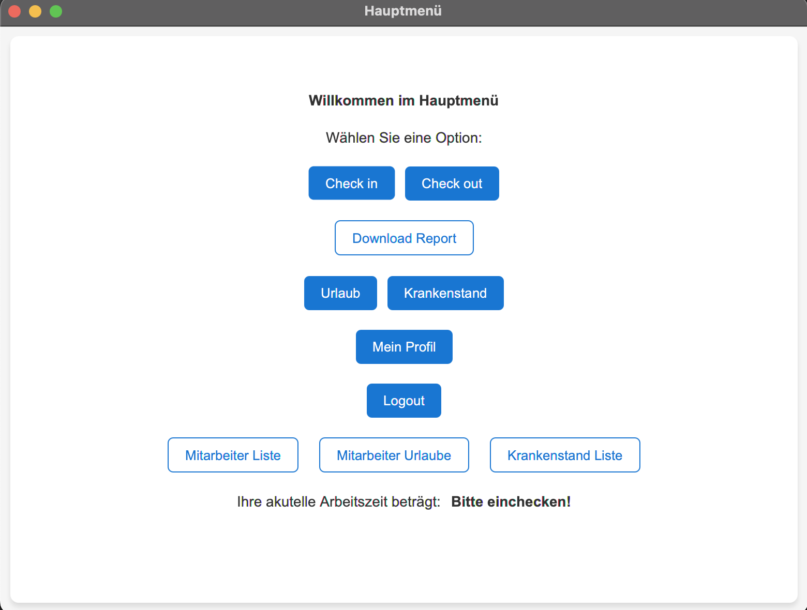
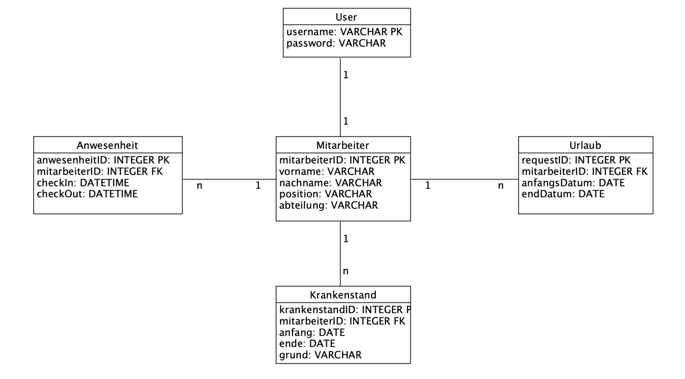

# JAVA Project - TimeTrack

 

<h2>Die Vision</h2>

Die Vision dieses Projektes ist es, ein einfaches, benutzerfreundliches und effizientes System zur Verwaltung von
Mitarbeitern in Unternehmen zu schaffen. TimeTrack wird das tägliche Management von Personalinformationen,
Anwesenheitsdaten, Urlaubsanträgen und Krankenständen optimieren und dabei helfen, bessere Entscheidungen auf der
Grundlage genauer und zeitnaher Daten zu treffen.

 

<h2>Eine Kurzbeschreibung</h2>

TimeTrack ist eine Anwendung zur Personalverwaltung, die das Zeil hat, Effizienz und Produktivität von Unternehmen zu
optimieren. Es ermöglicht eine einfache Verwaltung von Mitarbeiterinformationen wie die Überwachung der
Anwesenheitszeiten sowie die Handhabung von Urlaubszeiten und Krankenstände

Das Besondere an diesem Projekt liegt an der Fähigkeit, die genannten Funktionen in einer einzigen Anwendung zu
integrieren und Entscheidungen des Personalmanagements zu erleichtern.

Die größte Herausforderung liegt darin, ein intuitives und einfaches Design der Benutzeroberfläche zu entwickeln. Die
größte Möglichkeit dieses Projektes liegt darin, Unternehmen und Prozesse im Personalmanagement zu optimieren und als
effizient als möglich zu gestalten.

TimeTrack ist ein einmonatiges Projekt das mit der Java-Programmiersprache entwickelt wird. Die Anwendung wird bis zum
Ende des Zeitlimits entwickelt und getestet. Diese Anwendung ist messbar indem sie am Ende der Entwicklung Daten
aufnehmen, verarbeiten und ausgeben kann.

 
<h2>Grobe Spezifikation</h2>

<h3>Zusammenhang mit bereits bestehenden Systemen</h3>

TimeTrack ist ein eigenständiges System mit Ausnahme des Datenbankmanagement, welches mit SQLite entwickelt wird. Es
benötigt keine Integration in andere Systeme und ist somit einfacher in Unternehmen zu implementieren.

Das Programm besteht aus Funktionen wie Verwaltung von Mitarbeiterinformationen, Anwesenheitsverfolgung und
Abwesenheitsverfolgung. Funktionen die TimeTrack nicht bietet sind weitere Aspekte der Personalverwaltung wie
Gehaltsberechnung oder Rekrutierung. Noch dazu ist der Vorteil, dass TimeTrack ein eigenständiges Programm ist, auch ein
Nachteil, da es mit keinen bestehenden Anwendungen verbunden werden kann.

 
<h3>Schnittstellen</h3>

TimeTrack wird mit einer relationalen Datenbank erstellt und verwendet SQL um mit dieser zu interagieren.

 
<h3>Überblick über die geforderte Funktionalität</h3>

TimeTrack soll als Werkzeug für die Personalverwaltung dienen, um effizientere und einfachere Prozesse zu gestalten.

<ul>
  <li>Mitarbeiterinformationen:</li>
  Erfassung und Verwaltung von Daten der Mitarbeiter.
  Aktualisierung der Informationen.
  Suche nach bestimmten Mitarbeitern.

  <li>Anwesenheitsverfolgung:</li>
  Mitarbeiter können bei Dienstbeginn oder Dienstende ein- und auschecken.
  Überwachung der Gesamtstunden und Abwesenheit.

  <li>Abwesenheitsverfolgung:</li>
  Mitarbeiter können Urlaubsanträge stellen.
  Manager können diese Anträge genehmigen oder ablehnen.
  Mitarbeiter können sich krank melden und diesbezüglich notwendige Dokumente hochladen.
  Überblick der Urlaubstage und Krankenstände.
</ul>

 
<h3>Wesentliche Qualitätsanforderungen und Rahmenbedingungen</h3>

 
Technologische Vorgaben:
Sprache: Java sowie JavaFX Frameworks für die Benutzeroberfläche.
Datenbanksystem: Es wird SQLite verwendet, eine relationale Datenbank.
Entwicklungsumgebung: IntelliJ IDEA.
Betriebsystem: Die Anwendung sollte auf Windows, macOS und Linux funktionieren.

 
Nicht-funktionale Anforderungen:
Benutzerfreundlichkeit: Das System sollte eine intuitive Benutzeroberfläche haben und einfach zu benützen sein.
Performance: Es soll schnell sein und mit großen Mengen von Mitarbeiterdaten umgehen.
Skalierbarkeit: Die Anwendung soll in der Lage sein, sehr viele Mitarbeiterdaten aufzunehmen, ohne Leistung zu
verlieren.

 
Rahmenbedingungen:
Projektdauer: Die geplante Entwicklung liegt bei einem Monat.
Ressourcen: Die Anwendung wird von mir selbst entwickelt, mit meinen Java Kenntnissen und Erfahrungen mit relationalen
Datenbanken, die ich im Java Kurs vom WIFI mir angeeignet habe.

 
 
<h2>Detaillierte Spezifikation</h2>

<h3>Akteure des Systems (Personas) </h3>

<ul>
  <li>Mitarbeiter</li>
  <li>Management</li>
</ul>

 
<h3>Detaillierte Funktionale Anforderungen (Szenarios & Screens)</h3>

<b>Mitarbeiterinformationen</b>

<ul>
  <li><b>Erfassung:</b> Mitarbeiterinformationen wie Name, ID, Kontaktinformationen, Position, und Anstellungsdatum
    sollen hier erfasst werden.</li>
  <li><b>Suche:</b> Benutzer soll nach spezifischen Mitarbeitern suchen können. </li>
  <li><b>Aktualisierung:</b> Mitarbeiterinformationen können bearbeitet und aktualisiert werden.</li>
  <li><b>Löschen:</b> Individuelle Mitarbeiter soll man löschen können.</li>
</ul>

 
<b>Anwesenheitsverfolgung</b>

<ul>
  <li><b>Einchecken/Auschecken:</b> Mitarbeiter können ihre täglichen Dienstzeiten registrieren indem sie sich an- und
    abmelden.</li>
  <li><b>Überwachung:</b> Das System berechnet die Gesamtstunden der Mitarbeiter und kann dadurch Unregelmäßigkeiten
    festlegen. </li>
</ul>

 
<b>Abwesenheitsverwaltung</b>

<ul>
  <li><b>Urlaubsantrag: </b>Mitarbeiter können Urlaube beantragen.</li>
  <li><b>Krankenstand: </b>Mitarbeiter können ihren Krankenstand eintragen.</li>
  <li><b>Genehmigung: </b>Manager kann diese genehmigen oder ablehnen.</li>
  <li><b>Übersicht: </b>Mitarbeiter und Manager können Urlaubsanfragen sehen.</li>
</ul>

 
<b>Leistungsbewertung</b>

<ul>
  <li><b>Leistungsindikatoren: </b>Festlegung der KPIs (z.B. gelöste Tickets pro Tag)</li>
  <li><b>Bewertung: </b>Eine Möglichkeit für Manager um Feedback zu geben. </li>
</ul>

 
<h3>Schnittstellen</h3>

<b>Datenbankschnittstelle: </b>
<li>Direkte Interaktion mit SQLite durch JDBC.</li>
<li>Abfragen, Hinzufügen, Bearbeiten, und Löschen von Einträgen (CRUD Funktionalität).</li>

 
<b>Benutzeroberfläche:</b>
<li>Entwicklung mit JavaFX.</li>
<li>Verschiedene Ansichten die Funktionen repräsentieren.</li>

<b>Benutzerschnittstellen (GUI)</b>
Siehe beiliegende Datei (im Ordner “readMe” -> “TimeTrack-Wireframe.png”)

 
<h3>Nicht-Funktionale Anforderungen</h3>

<b>Vorgaben zu Hardware und Software</b>

Hardwarevorgaben gibt es wenige da die Anwendung nicht viel beansprucht. Jedoch sollte es genügend Speicherplatz geben,
um Daten speichern zu können.

Die Software-Umgebung dieser Anwendung entsteht aus Java JDK, IntelliJ IDEA und einer SQLite Datenbank.

<b>Security & Safety</b>

<ul>
  <li><b>Authentifizierung: </b>Nutzer registrieren sich und erstellen somit ihr eigenes Passwort welches gehasht und
    gesalted
    wird. Nur authentifizierte Nutzer können auf das System zugreifen.</li>
  <li><b>Autorisierung: </b>Mitarbeiter können nur ihre eigenen Daten sehen. Manager haben erweiterte Berechtigungen und
    können alle Mitarbeiterdaten abrufen sowie bearbeiten.</li>
</ul>

 
<h3>Systemabgrenzung, Systemarchitektur und Datenhaltung</h3>

TimeTrack ist als Standalone-Applikation konzipiert. Es bietet den Benutzern (Mitarbeiter und Manager) die Möglichkeit,
Arbeitszeiten zu erfassen und überwachen.

Datenbankschnittstelle: Das System greift auf eine zentrale Datenbank zu, in der sich alle relevanten Daten gespeichert
werden

Datenbankarchitektur:

Das System verwendet eine relationale Datenbank zur Speicherung aller relevanten Daten und besteht aus Tabellen für
Anwesenheit, Mitarbeiter und Urlaub.

 
<h3>Rahmenbedingungen</h3>

<b>Technologische Vorgaben:</b>
<ul>
  <li>Die Software muss in Java entwickelt werden und auf der JVM laufen.</li>
  <li>Es muss eine Schnittstelle zu SQL-basierten Datenbanken geben.</li>
  <li>Es muss eine grafische Benutzeroberfläche haben.</li>
</ul>

<b>Kompatibilität:</b>
<ul>
  <li>Die Software ist eine stand-alone Anwendung und muss auf Windows oder macOS Betriebssystemen lauffähig sein.</li>
</ul>

<b>Standards:</b>
<ul>
  <li>Passwörter müssen gehasht und gesichert sein.</li>
</ul>

<b>Zeitliche Vorgaben:</b>
<ul>
  <li>Das Projekt muss bis 29.09.2023 abgeschlossen sein.</li>
</ul>

<b>Wichtige Produktmerkmale:</b>
<ul>
  <li>Die Software muss eine Benutzerverwaltung ermöglichen, einschließlich Rollenbasierendem Zugriff.</li>
  <li>Es muss möglich sein, Berichte basierend auf den gespeicherten Daten zu generieren.</li>
</ul>

<b>Nicht enthalten:</b>

Integration mit anderen Softwareprodukten.
Schulungen oder Workshops für Endbenutzer.

Geforderte Meilensteine und Liefertermine
Erster funktionsfähiger Prototyp: 22.09.2023
Finale Version: 29.09.2023

 
<h2>Benutzerhandbuch</h2>

 
<h3>1. Erste Schritte</h3>

<b>1.1. Systemanforderungen</b>
<ul>
  <li>Java Runtime Environment (JRE) installiert</li>
  <li>Datenbankverbindung eingerichtet</li>
</ul>

<b>1.2. Installation</b>
<ul>
  <li>Die Software wird als Java-Anwendung geliefert. Stellen Sie sicher, dass die JRE installiert ist und führen Sie
    die Anwendung aus.</li>
</ul>

 
<h3>2. Anmelden</h3>

Nach dem Starten der Software wird ein Anmeldebildschirm angezeigt:

<b>2.1. Anmeldung</b>
<ul>
  <li>Geben Sie Ihren Benutzernamen und Ihr Passwort ein.</li>
  <li>Klicken Sie auf "Login".</li>
  <li>Wenn Ihre Daten korrekt sind, werden Sie zum Hauptbildschirm weitergeleitet.</li>
</ul>

<b>2.2. Neues Profil Erstellen</b>
<ul>
  <li>Klicken Sie auf "Registrieren".</li>
  <li>Folgen Sie den Anweisungen, um ein neues Profil zu erstellen.</li>
</ul>

 
<h3>3. Hauptbildschirm</h3>

Abhängig von Ihrer Position (z. B. Manager) haben Sie möglicherweise unterschiedliche Ansichten und Funktionen.

<b>3.1. Arbeitszeit Verfolgen (für alle Benutzer)</b>
<ul>
  <li>Wählen Sie “Check in” um das Datum und die Uhrzeit für den Beginn Ihrer Arbeitszeit zu registrieren.</li>
  <li>Wählen Sie “Check out” um das Ende Ihrer Arbeitszeit zu protokollieren.</li>
  <li>Das System berechnet Ihre gearbeiteten Stunden.</li>
  <li>Vergangene Arbeitszeiten können mit “Download Report” als CSV Datei heruntergeladen werden.</li>
</ul>

<b>3.2. Überwachung der Arbeitszeit (nur für Manager)</b>
<ul>
  <li>Sie können eine Liste aller Mitarbeiter sehen und ihre Arbeitszeitdetails überprüfen.</li>
  <li>Es ist möglich, die Daten zu bearbeiten, falls Änderungen erforderlich sind, oder auch löschen und hinzufügen.
  </li>
</ul>

<b>3.3. Urlaub beantragen (für alle Benutzer)</b>
<ul>
  <li>Im Hauptmenü können Sie auf “Urlaub beantragen” klicken.</li>
  <li>Wählen Sie in diesem View das Datum und die Uhrzeit für den Beginn und das Ende Ihres Urlaubes.</li>
  <li>Klicken Sie auf “Beantragen”. Ihr Manager wird diesen dann entweder bestätigen, verewigen, oder auf ausstehend
    setzten.</li>
  <li>Sie werden über den Status benachrichtig, indem ein Button im Urlaub Menü erscheint.</li>
</ul>

<b>3.4. Überwachung der Urlaube (nur für Manager)</b>
<ul>
  <li>Sie können eine Liste aller Mitarbeiter sehen und ihre Urlaubsanträge überprüfen und darauf auch reagieren.</li>
  <li>Der Mitarbeiter wird benachrichtigt, sobald sich der Status des Antrages geändert hat.</li>
</ul>

 
<h3>4. Bearbeiten der Tabellen</h3>

Es können beide Tabellen (Arbeitszeit- und Urlaubstabelle) bearbeitet werden

<b>2.1. Anmeldung</b>
<ul>
  <li>Geben Sie Ihren Benutzernamen und Ihr Passwort ein.</li>
  <li>Klicken Sie auf "Login".</li>
  <li>Wenn Ihre Daten korrekt sind, werden Sie zum Hauptbildschirm weitergeleitet.</li>
</ul>

<b>2.2. Neues Profil Erstellen</b>
<ul>
  <li>Klicken Sie auf "Registrieren".</li>
  <li>Folgen Sie den Anweisungen, um ein neues Profil zu erstellen.</li>
</ul>

 
<h3>5. Beenden der Software</h3>

Schließen Sie einfach das Hauptfenster, um die Anwendung zu beenden. Sie können sich jedoch auch abmelden, indem Sie auf
“Logout” klicken.

 
<h3>6. Support und Hilfe</h3>

Bei technischen Problemen oder Fragen zur Software wenden Sie sich bitte an den Support bei Alexander Ullmann